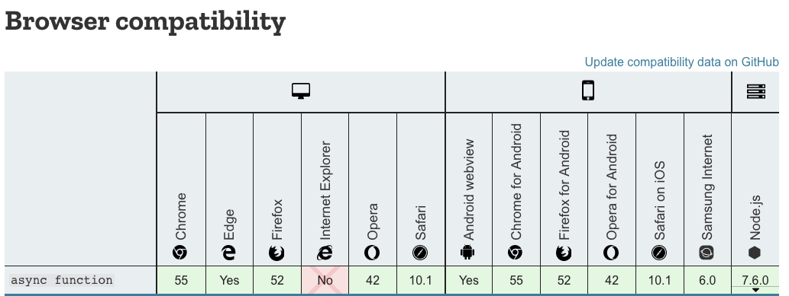
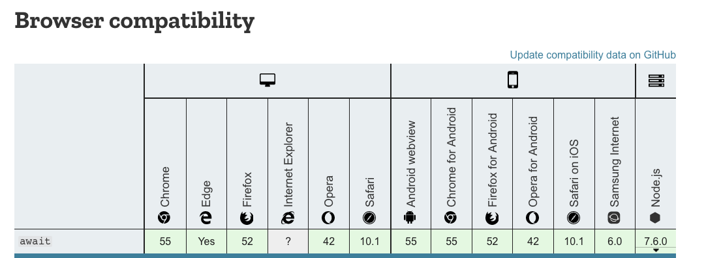

#  

## Async && Await

### 基本用法

- async (asynchrony：异步函数) ES2017提出的标准

  - MDN解释:用来定义一个返回 AsyncFunction(<small>执行 AsyncFunction 构造函数的时候，会创建一个 异步函数 对象。但是这种方式不如先用 异步函数表达式 定义一个异步函数，然后再调用其来创建 异步函数 对象来的高效，因为第二种方式中异步函数是与其他代码一起被解释器解析的，而第一种方式的函数体是单独解析的。</small>) 对象的异步函数。异步函数是指通过事件循环异步执行的函数，它会通过一个隐式的 Promise 返回其结果。如果你在代码中使用了异步函数，就会发现它的语法和结构会更像是标准的同步函数。

  - [async](async.html)

  - 总结：async函数的执行后会返回一个promise 对象，并且把内部的值进行使用进行promise的封装。如果promise对象通过then或catch方法又注册了回调函数，async函数执行完以后，**注册的回调函数就会放到异步队列中，等待执行**

- await

  - MDN解释: await  操作符用于等待一个Promise 对象。它只能在异步函数 async function 中使用。

  - await 后面可以接任何东西

  - [await](await.html)

  - 总结：添加了await关键字,就需要等待前一个语句执行完才能执行下一个语句

### 兼容性

  

### 其他

1. 同步执行只会在async函数中，主程序还是会继续向下执行；(如果在async中遇到await,感觉会把await后面的代码注册成一个微任务);[执行顺序](runSequence.html)

2. 关于并行，await和async的使用 [async/await的并行](parallel.html)

### 与 Generator/yeild 区别

1. 与Promise对比，解决了多层回调 [constructPromise](constructPromise.html)

2. [一篇文章总结Generator/yield与 async await](https://www.jianshu.com/p/c94edc0057fe)

### 参考链接

- [async function MDN](https://developer.mozilla.org/zh-CN/docs/Web/JavaScript/Reference/Statements/async_function)
- [await function MDN](https://developer.mozilla.org/zh-CN/docs/Web/JavaScript/Reference/Operators/await)
- [深入浅出——Async](https://github.com/youzaiyouzai666/blog/blob/master/%E5%9F%BA%E7%A1%80%E7%9F%A5%E8%AF%86%E7%82%B9%E6%B7%B1%E5%85%A5/%E6%B7%B1%E5%85%A5%E2%80%94Async.md)
- [[译文]如何避开 async/await 地狱](https://juejin.im/post/5b9db6925188255c3b7d78cb)
